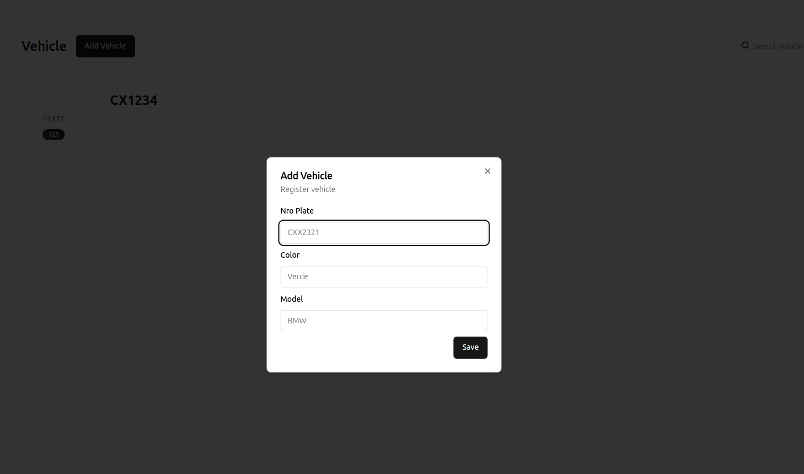

# Registro de infracciones

1. Estructura del proyecto
  
```bash
app -> Se encuentra el proyecto de frontend en react
backend -> Se encuentra el proyecto backend en FastApi

# Directorios para la configuracion inical del servidor web y de la base de datos
nginx
postgres-conf
```

1.1 Ejemplo de la interfaz administrativa

### Pagina de login

<p align="center">
  
</p>

```bash
# Para ingresar al login se debe colocar
email: daniel
password : 1234
```

### Reporte Publico se puede descargar en formato json o csv

<p align="center">
  
</p>

### Listado de usuarios, se pueden crear oficiales a partir de un usuario normal

<p align="center">
  
</p>

<p align="center">
  
</p>

### Lista de vehiculos la idea es que un oficial seleccione un vehiculo y en ese instante ya se estaria realizando la infraccion a partir de un comentario

<p align="center">
  
</p>
<p align="center">
  
</p>
<p align="center">
  
</p>

### Salir a login

<p align="center">
  
</p>

### Listado de infracciones

<p align="center">
  
</p>

Es una interfaz `sencilla` y amigable, se uso `react`, `tailwindcss`, `zustand` para los estados,`vite`, etc..., para el desarrollo

2. Un usuario tienen que tener la marca de `policy` en la tabla usuarios esto identificara que es un oficial de policia el cual puede realizar infracciones

3. El metodo generar informe se transformo a dowloadReport que es un poco mas generico por que me permite descargar un reporte a partir de un email de oficial el cual se puede recolectar en formato `CSV` o `JSON`

4 y 5. Se realizo un docker compose el cual tiene la configuracon basica del aplicativo

```bash
# Ejecutar el siguiente comando
docker compose up -d --build
```

Una vez ejecutado el comando podemos ir a las siguentes rutas

Rest api, para la app de infracciones
Se pueden enctronar todos los metodos de la `api` expuestos

```bash
http://localhost:9000/docs
```


PGAdmin para administrar la base de datos de postgres

```bash
http://localhost:5000/login

# Para los acccesos usar
username = daniel@gmail.com
password = 1234
```

- Una vez dentro de pgadmin ejecutar los siguientes scripts en caso de que no se hayan instanciado antes ejecutar el archivo init.sql
- Los usuarios is_superuser pueden crear mas usuarios
  Para los acccesos user y policy
  el usuario inicial se creara a partir del `script`.

```bash
# Para el acceoso a las base de datos
DB_USER=usr_daniel
DB_PASSWORD=1234
DB_HOST=localhost
DB_PORT=5432
DB_NAME=db_test
```

Se uso `FastApi`(python) para el backend, se puede revisar la documentacion de los servicios expuestos en el siguiente link `http://localhost:9000/docs`

6. La arquitectura propuesta seria la siguiente

- Para la DB (Base de datos) usarios el servio de RDS
- Para el tema los aplicativos ya sea docker (ECS) o empaquetarlo todo en un EC2 para el caso el script

```bash
docker-compose.yml
```

se puede ejecutar en un EC2 previamnete instalando docker todo esta un un fichero ya configurado.

En caso de realizar un despliegue pos ECS se deben generar los dockers deste github actions para realizar el CI/CD respectivo el cual hara un despligue automatico

Se debe considerar que los servicios de amazon pueden escalar en capacidad y potencia. 